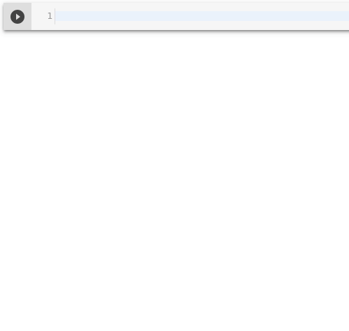

readin
======

``readin`` currently contains a function that conveniently downloads the
timeline of a Twitter profile and stores it in a ``pandas.DataFrame``, 
like so:

.. code:: python

    import readin

    df = readin.from_twitter(screen_name, **creds)

When having the timeline in the ``DataFrame``, analyzing it becomes a 
no-brainer:

.. code:: python

    df.set_index('created_at', inplace=True)
    df.resample(rule='1w').favorite_count.sum().plot()

The whole procedure takes less than a minute after installation:

|Favorite_Counts|

Installation
------------

.. code:: sh

    $ pip install git+https://github.com/stefangindl/readin.git

